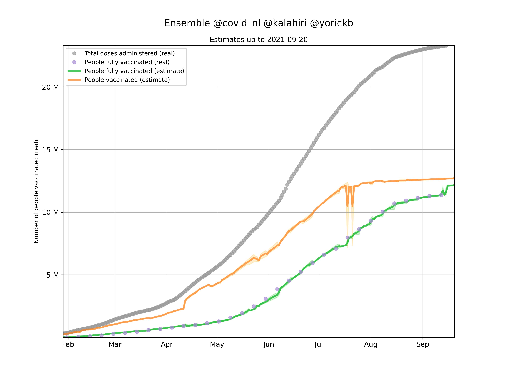
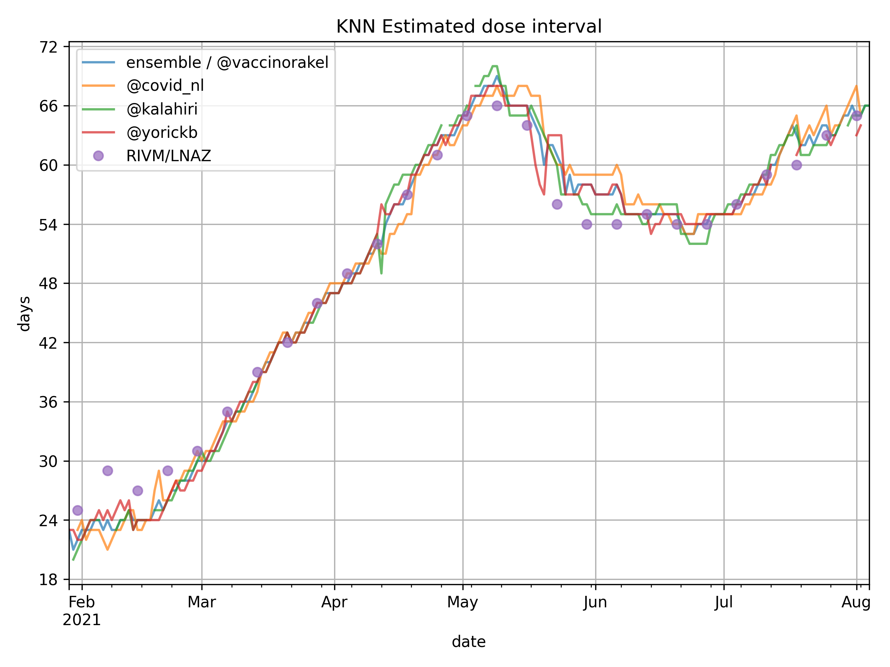

# Het vaccinatie orakel
Een ensemble aan modellen die de vaccinatiegraad voorspellen. Het Orakel verzamelt voorspellingen uit verschillende databronnen en middelt deze.

## Meest recente voorspelling van het orakel

[data/ensemble.csv](data/ensemble.csv)

## Schatting gemiddelde dosis-interval over alle vaccinaties

[data/estimated_dose_interval.csv](data/estimated_dose_interval.csv)

## Verhouding RIVM/LNAZ data vs. ensemble / orakel vs. 'deel aantal doses door twee'-strategie

[data/comparison-ensemble-vs-divbytwo.csv](data/comparison-ensemble-vs-divbytwo.csv)

## Uitleg databestanden
Voor de scope van deze readme houden we het bij het documenteren van de csv bestanden. Soms zijn er gelijknamige png bestanden, dit zijn vaak grafieken die de data inzichtelijk trachten te maken. Ook kan het voorkomen dat er een gelijknamige json te vinden is. Die bevatten vaak dezelfde data als de gelijknamige csv. Wij geven geen garantie dat de jsons in de toekomst blijven bestaan, gebruik daarom dus de csv bestanden.

### [data/ensemble.csv](data/ensemble.csv)
Dit is de output van het ensemble en dit is dus zeer waarschijnlijk de file die je zoekt.  

`total_vaccinations` aantal doses geinjecteerd  
`people_vaccinated` aantal mensen dat tenminste een prik heeft ontvangen  
`people_fully_vaccinated` aantal mensen volledig gevaccineerd  

### [data/metrics.csv](data/metrics.csv)
Kwantitatieve metrics die een beeld geven hoe correct het ensemble en de verschillende modellen zijn.  

`model` naam van het model  
`explained_variance` [https://scikit-learn.org/stable/modules/generated/sklearn.metrics.explained_variance_score.html](https://scikit-learn.org/stable/modules/generated/sklearn.metrics.explained_variance_score.html)  
`mean_squared_log_error` [https://scikit-learn.org/stable/modules/generated/sklearn.metrics.mean_squared_log_error.html](https://scikit-learn.org/stable/modules/generated/sklearn.metrics.mean_squared_log_error.html)  
`r2` [https://scikit-learn.org/stable/modules/generated/sklearn.metrics.r2_score.htm](https://scikit-learn.org/stable/modules/generated/sklearn.metrics.r2_score.htm)  
`MAE` [https://scikit-learn.org/stable/modules/generated/sklearn.metrics.mean_absolute_error.html](https://scikit-learn.org/stable/modules/generated/sklearn.metrics.mean_absolute_error.html)  
`MSE` [https://scikit-learn.org/stable/modules/generated/sklearn.metrics.mean_squared_error.html](https://scikit-learn.org/stable/modules/generated/sklearn.metrics.mean_squared_error.html)  
`RMSE` Square Root of MSE  
`count_datapoints` het aantal datapunten dat zijn gebruikt voor deze metrics  

### [data/intersect-metrics.csv](data/intersect-metrics.csv)
Kwantitatieve metrics die een beeld geven hoe correct het ensemble en de verschillende modellen zijn. Het verschil tussen deze metrics en de hierboven genoemde metrics is dat de metrics alleen berekend worden over datapunten waarvoor alle modellen een voorspelling hebben.

`model` naam van het model  
`explained_variance` [https://scikit-learn.org/stable/modules/generated/sklearn.metrics.explained_variance_score.html](https://scikit-learn.org/stable/modules/generated/sklearn.metrics.explained_variance_score.html)  
`mean_squared_log_error` [https://scikit-learn.org/stable/modules/generated/sklearn.metrics.mean_squared_log_error.html](https://scikit-learn.org/stable/modules/generated/sklearn.metrics.mean_squared_log_error.html)  
`r2` [https://scikit-learn.org/stable/modules/generated/sklearn.metrics.r2_score.htm](https://scikit-learn.org/stable/modules/generated/sklearn.metrics.r2_score.htm)  
`MAE` [https://scikit-learn.org/stable/modules/generated/sklearn.metrics.mean_absolute_error.html](https://scikit-learn.org/stable/modules/generated/sklearn.metrics.mean_absolute_error.html)  
`MSE` [https://scikit-learn.org/stable/modules/generated/sklearn.metrics.mean_squared_error.html](https://scikit-learn.org/stable/modules/generated/sklearn.metrics.mean_squared_error.html)  
`RMSE` Square Root of MSE  
`count_datapoints` het aantal datapunten dat zijn gebruikt voor deze metrics  

### [data/models](data/models)
De csv bestanden in deze folder zijn de outputs van de individuele modellen. Deze worden in een ensemble samengevoegd.  

`total_vaccinations` aantal doses geinjecteerd  
`people_vaccinated` aantal mensen die tenminste een prik hebben ontvangen  
`people_fully_vaccinated` aantal mensen volledig gevaccineerd  
