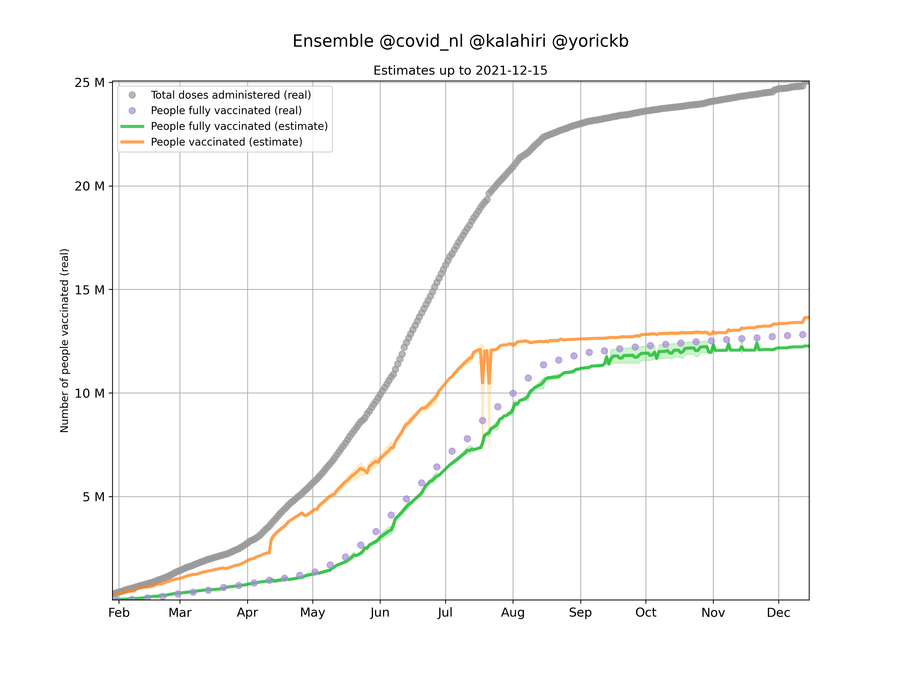

# Het vaccinatie orakel
Een ensemble aan modellen die het aantal gevaccineerden voorspellen.

## Nieuwste versie van het orakel

[data/ensemble.csv]()

## Uitleg databestanden
Voor de scope van deze readme houden we het bij het documenteren van de csv bestanden. Soms zijn er gelijknamige png bestanden, dit zijn vaak grafieken die de data inzichtelijk trachten te maken. Ook kan het voorkomen dat er een gelijknamige json te vinden is. Die bevatten vaak dezelfde data als de gelijknamige csv. Wij geven geen garantie dat de jsons in de toekomst blijven bestaan, gebruik daarom dus de csv bestanden.

### [data/ensemble.csv]()
Dit is de output van het ensemble en dit is dus zeer waarschijnlijk de file die je zoekt.

`total_vaccinations` aantal doses geinjecteerd
`people_vaccinated` aantal mensen dat tenminste een prik heeft ontvangen
`people_fully_vaccinated` aantal mensen volledig gevaccineerd

### [data/metrics.csv]()
Kwantitatieve metrics die een beeld geven hoe correct het ensemble en de verschillende modellen zijn.
`metric` naam van de metric
`ensemble` metrics voor het `ensemble.csv`
`@<naam>` de naam van het model, op dit moment tevens de twitter-handle van de betreffende source

### [data/models]()
De csv bestanden in deze folder zijn de outputs van de individuele modellen. Deze worden in een ensemble samengevoegd.  

`total_vaccinations` aantal doses geinjecteerd
`people_vaccinated` aantal mensen dat tenminste een prik heeft ontvangen
`people_fully_vaccinated` aantal mensen volledig gevaccineerd
